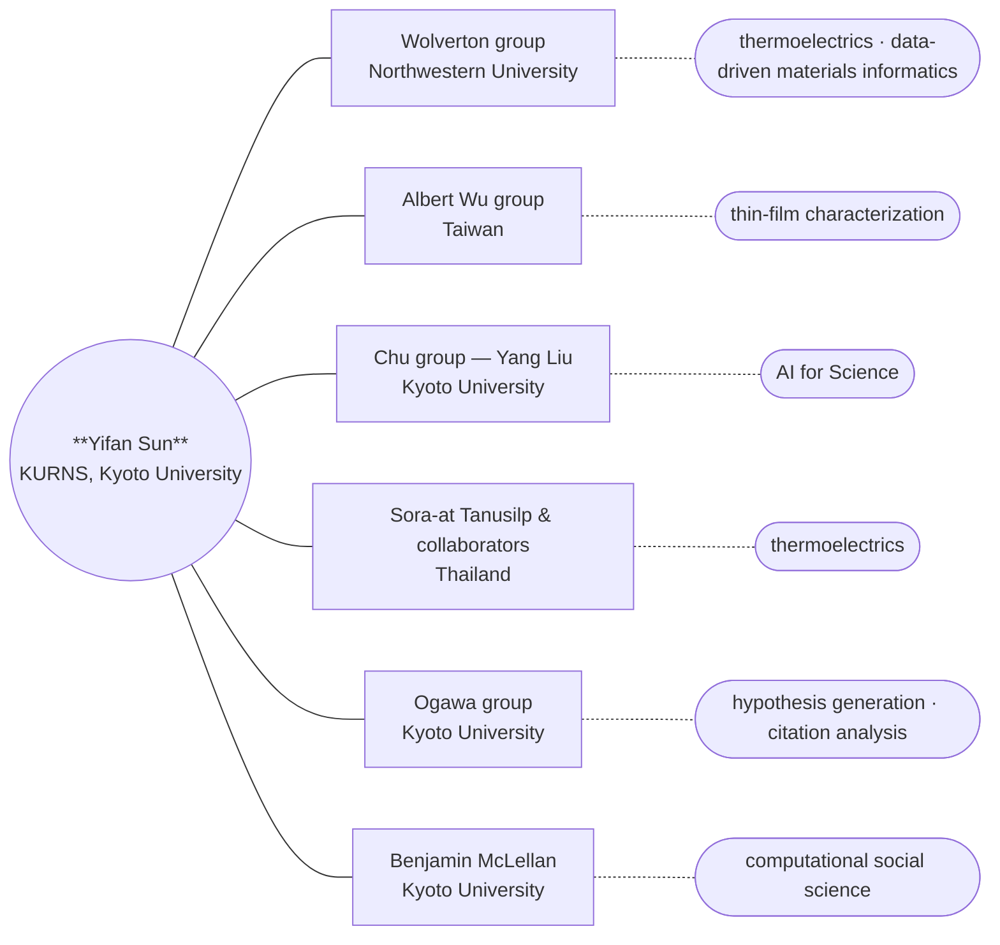

- **Wolverton group** (Northwestern University) — thermoelectrics and data-driven materials informatics.
- **Albert Wu group** (Taiwan) — thin-film characterization.
- **Chu group** (Kyoto University; with Yang Liu) — AI for Science.
- **Sora-at Tanusilp and collaborators** (Thailand) — thermoelectric materials.
- **Ogawa group** (Kyoto University) — hypothesis generation and citation analysis.
- **Benjamin McLellan** (Kyoto University) — computational social science.
